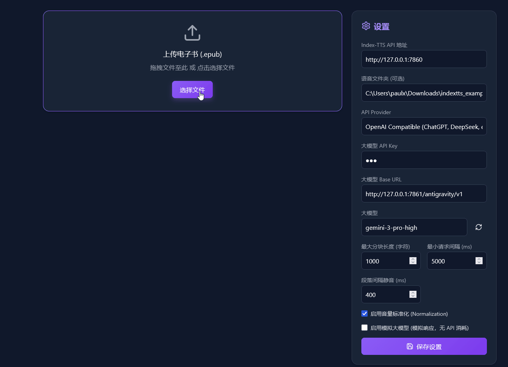
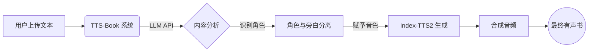

# TTS-Book

[English](README_EN.md)

## 项目介绍

**TTS-Book** 是一个有声书制作工具，解决传统 TTS "照本宣科" 的问题。

传统 TTS 只会按顺序朗读文字。TTS-Book 用 LLM 理解文本，区分旁白和对话，分析角色情绪（开心、愤怒、悲伤），修正多音字读音，最后用 Index-TTS2 为每个角色匹配音色。

适合想做多角色有声书，又不想花几小时手动标注角色和纠正读音的人。

### 生成效果

https://github.com/user-attachments/assets/90fd86b5-5754-45f6-88bf-9db6c3ce0e8a

> 第三章 续优胜记
>
> 略然而阿Q虽然常优胜，却直待蒙赵太爷打他嘴巴之后，这才出了名。他付过地保二百文酒钱，愤愤的躺下了，后来想："现在的世界太不成话，儿子打老子……"于是忽而想到赵太爷的威风，而现在是他的儿子了，便自己也渐渐的得意起来，爬起身，唱着《找孤孀上坟》到酒店去。这时候﹐他又觉得赵太爷高人一等了。说也奇怪﹐从此之后﹐果然大家也仿佛格外尊敬他。这在阿Ｑ﹐或者以为因为他是赵太爷的父亲﹐而其实也不然。未庄通例﹐倘如阿七打阿八﹐或者李四打张三 ﹐向来本不算一件事﹐必须与一位名人如赵太爷者相关
>
> —— 鲁迅《阿Q正传》

### 功能

*   **情绪感知**：LLM 根据上下文判断语调，让声音有戏。
*   **多音字纠正**：自动识别语境修正多音字（区分"重担"与"重新"，"长短"与"长大"）。
*   **角色分轨**：自动分离旁白和对话，不同角色不同音色。
*   **角色管理**：LLM 可能把同一人识别成两个角色，可以手动合并修正。
*   **灵活配置**：支持自定义 LLM API 和 Index-TTS2 服务。

### 工作流程

### 前置准备

1.  **Index-TTS2 运行环境**
    本地运行 Index-TTS2 的 WebUI。
    *   **Windows 用户**：推荐下载 [懒人整合包](https://drive.google.com/file/d/1ZiZ6XABgRvQSy6k69_3ICxssA52RhFi2/view?usp=sharing)，解压后双击 `.bat` 脚本即可启动。
2.  **LLM API**
    *   **在线 API**：支持 Gemini, OpenAI 等。
    *   **本地部署**：兼容 OpenAI 格式的接口（Ollama, vLLM 等）都能用。

### 使用方法

1.  启动 Index-TTS2 的 WebUI。
2.  在 TTS-Book 中填入 LLM API 地址和 Index-TTS2 地址。
3.  上传文本文件。
4.  点击"LLM 分析"，系统解析文本并识别角色。
5.  检查角色分配，用 Index-TTS2 生成音频。

### 模型推荐

*   推荐 `Gemini 2.5 Pro` 和 `Mimo v2 Flash`。
*   不要用 7B 以下的小模型，上下文丢失严重，角色和情感分析不准。
