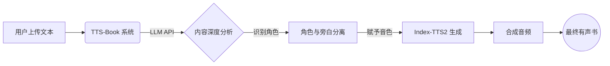

# TTS-Book

[English](README_EN.md)

## 项目介绍

**TTS-Book** 是一个有声书制作工具，致力于解决传统 TTS "原本照读" 的生硬感。

不同于传统 TTS 按顺序朗读，TTS-Book 利用 **大语言模型（LLM）** 深度理解文本。它能听懂剧情，不仅区分旁白与对话，还能分析角色当下的情绪语气（是开心还是难过），甚至根据语境修正多音字的读音。最后，它使用 **Index-TTS2** 引擎为每个角色匹配专属音色。

如果你想制作多角色有声书，但不想花几个小时手动标注角色和纠正读音，这个工具就是为你准备的。

### 核心功能

*   **情绪感知**：LLM 会根据上下文判断语调（开心、悲伤、冷静等），让声音有戏，不再是毫无感情的机器音。
*   **多音字纠正**：自动识别语境并修正多音字（比如区分“重担”与“重新”，“长短”与“长大”），大幅减少人工听审的工作量。
*   **角色分轨**：自动剥离旁白与角色对话，给不同的角色分配不同的音色。
*   **角色管理**：LLM 偶尔也会犯错（比如把同一个人识别成两个角色），TTS-Book 允许你手动合并这些角色，统一管理，轻松修正小瑕疵。
*   **灵活配置**：支持自定义外部 LLM API 和 Index-TTS2 服务。

### 工作流程

### 前置准备

在开始之前，你需要确手头有以下两样东西：

1.  **Index-TTS2 运行环境**
    你需要本地运行 Index-TTS2 的 WebUI。
    *   **Windows 用户**：推荐直接下载 [懒人整合包](https://drive.google.com/file/d/1ZiZ6XABgRvQSy6k69_3ICxssA52RhFi2/view?usp=sharing)。解压后，双击运行包里的 `.bat` 脚本就能启动，不需要复杂的环境配置。
2.  **LLM API**
    你需要一个能用的 LLM API。
    *   **在线 API**：支持 Gemini, OpenAI 等主流服务。
    *   **本地部署**：只要兼容 OpenAI 格式的本地接口（如 Ollama, vLLM）也都能直接使用。

### 使用方法

1.  **启动 Index-TTS2**：确保 Index-TTS2 的 WebUI 已启动。
2.  **配置**：
    *   在 TTS-Book 中填入 LLM API 地址（支持 Gemini, OpenAI）。
    *   填入 Index-TTS2 地址。
3.  **上传**：在 Web 界面上传文本文件。
4.  **分析**：点击 **"LLM 分析"**，系统会解析文本并识别角色。
5.  **生成**：检查角色分配没问题后，使用 **Index-TTS2** 生成音频。

### 模型推荐

*   **推荐**：`Gemini 3 Pro` 和 `Mimo v2 Flash`。
*   **注意**：不要用 7B 及以下的小模型。切分文本虽然能跑，但上下文丢失严重，角色和情感分析不准。
