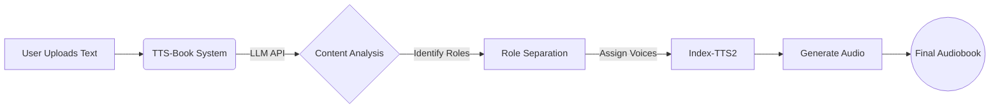

# TTS-Book

[中文](README.md)

## Introduction

**TTS-Book** is a tool designed to create multi-character audiobooks, moving beyond the flat, "read-aloud" style of traditional TTS.

It uses **Large Language Models (LLM)** to actually understand the story. Instead of simply reading text sequentially, it identifies who is speaking and *how* they are feeling. The system separates narration from dialogue, detects the emotional tone (happy, sad, etc.) for each line, and handles accurate pronunciation for context-dependent words. It then uses the **Index-TTS2** engine to assign distinct, expressive voices to each character.

It automates the tedious manual tagging usually needed to produce high-quality multi-character audio.

### Key Features

*   **Context-Aware Emotion**: The LLM reads the room. It detects the speaker's tone (e.g., angry, surprised, calm) based on the plot, instructing the TTS engine to perform the line rather than just read it.
*   **Smart Pronunciation**: Automatically disambiguates polyphonic characters and context-dependent pronunciations (using Pinyin annotations for Chinese), saving hours of manual proof-listening.
*   **Role Separation**: Intelligently separates narrator text from character dialogue.
*   **Character Management**: LLMs aren't perfect. If it mistakenly splits one character into two (or more), you can easily merge them manually and manage the cast list to ensure consistency.
*   **Customizable**: Works with standard LLM APIs and custom Index-TTS2 setups.

### Workflow

### Prerequisites

Before you start, make sure you have these two things ready:

1.  **Index-TTS2 Environment**
    You need to have the Index-TTS2 WebUI running locally.
    *   **Windows Users**: You can grab the [standalone package here](https://drive.google.com/file/d/1ZiZ6XABgRvQSy6k69_3ICxssA52RhFi2/view?usp=sharing). Just unzip it and run the included `.bat` script. No complex setup required.
2.  **LLM API**
    You need a working LLM API key.
    *   **Online**: Supports Gemini, OpenAI, and other major providers.
    *   **Local**: Any OpenAI-compatible local endpoint (like Ollama, vLLM) works fine.

### Usage

1.  **Launch Index-TTS2**: Make sure Index-TTS2 WebUI is running.
2.  **Configure**: 
    *   Set your external LLM API configurations (e.g., Gemini, OpenAI compatible).
    *   Set the Index-TTS2 address in TTS-Book.
3.  **Upload**: Upload your text file.
4.  **Analyze**: Click **"LLM Analysis"** to parse text and assign roles.
5.  **Generate**: Click "Generate Audio" to create the audio.

### Recommendations

*   **Models**: `Gemini 3 Pro`, `Mimo v2 Flash`.
*   **Note**: Avoid models sized 7B or smaller. They struggle with context and role identification. Reducing text chunk size usually just breaks context rather than fixing the analysis quality.
